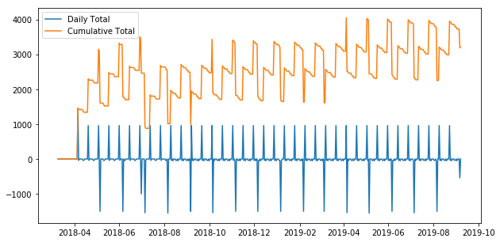

# PyFinance

This contains notebooks about personal finances in python, this is base on a book
of [Max Humber](https://twitter.com/maxhumber), and a talk he gave at [PyCon Colombia](https://www.pycon.co/)

